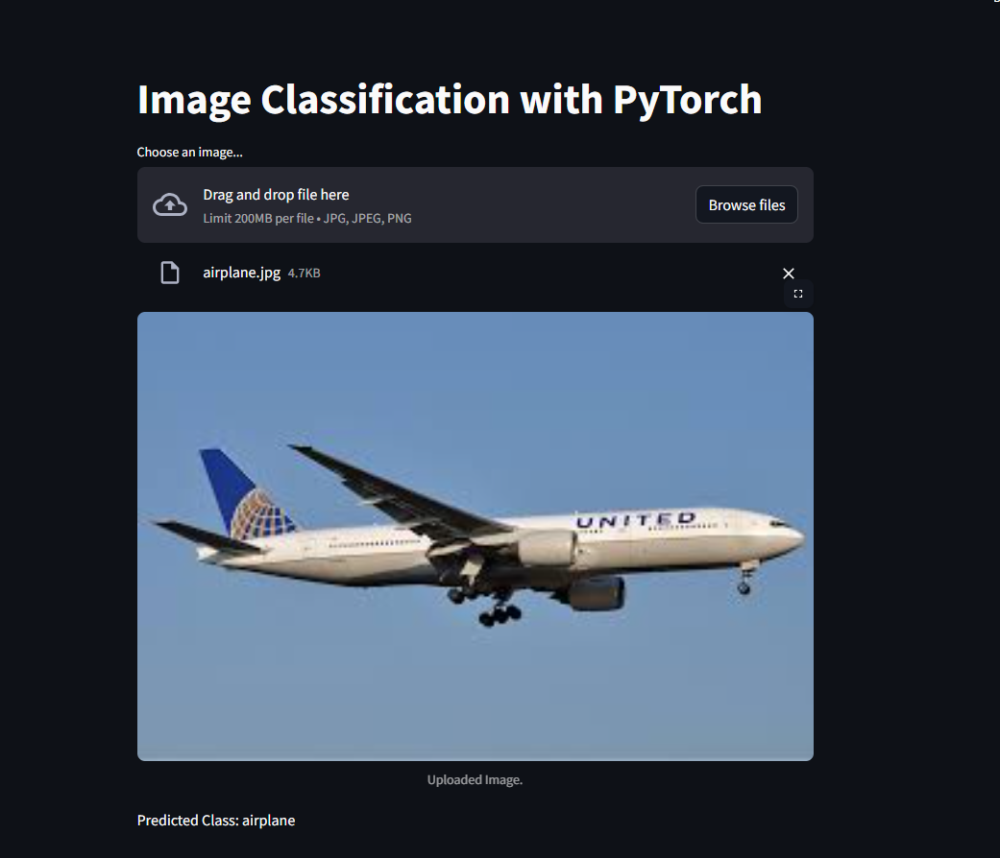

# Image Classification with PyTorch

This project implements an **image classification model** using the **CIFAR-10 dataset**. The model is built using **PyTorch**, and the goal is to classify images into 10 different categories such as airplanes, cars, dogs, etc.

## 🚀 Live Demo
Check out the live demo of the project: [Try the Image Classification App](https://syedmoaz14-image-classification-app-gz8hgi.streamlit.app/)


## 📸 Screenshots

### Interface


### Result


## 🔬 How It Works

- **Data**: Trained on a dataset of **CIFAR-10 images**.
- **Preprocessing**:
  - Images were normalized and transformed using **PyTorch transforms**.
  - Data augmentation can be added for better generalization.
- **Model**: The model uses **Convolutional Neural Networks (CNN)** built with **PyTorch**.
- **App**: The training process is executed with **PyTorch**, and the results are visualized in the web application.

## ⚙️ Tech Stack

- **Python**: The primary programming language for the model.
- **PyTorch**: Used for building and training the model.
- **Streamlit**: For building the interactive demo web app.
- **Matplotlib**: For visualizing results and displaying images.
- **Numpy**: For handling array operations.
- **Torchvision**: For accessing the CIFAR-10 dataset and related functionalities.

## Setup:

### 1. Clone the repository:

```bash
git clone https://github.com/syedmoaz14/image-classification-pytorch.git
```
### 📑 Folder Structure:
```
├── .gitignore
├── README.md
├── requirements.txt
├── main.py
├── /data
```
